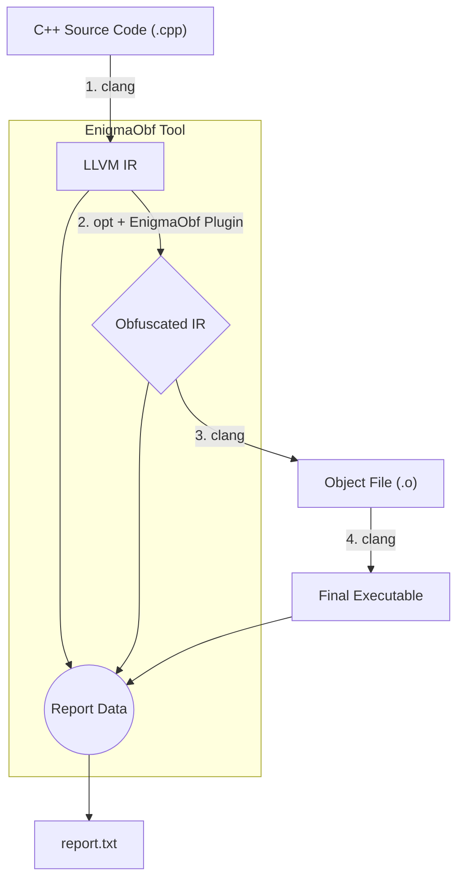

# EnigmaObf

**An LLVM‑Based Code Obfuscator**

> A modular, multi-pass obfuscation toolkit for C++ — designed to make reverse engineering expensive and time-consuming.

---

## Table of Contents

1. About the Project
2. Key Features
3. Architecture
4. The Obfuscation Passes
5. Requirements
6. Installation
7. Usage Guide
8. The Report File
9. Examples
10. Contributing
11. License

---

## About the Project

**EnigmaObf** is a command-line obfuscation tool created for the Smart India Hackathon (SIH) 2025 to address NTRO Problem Statement ID: **25236**. It integrates into the LLVM toolchain and transforms LLVM IR to produce functionally equivalent, but intentionally complex binaries — protecting intellectual property and increasing the effort required for reverse engineering.

EnigmaObf is designed to be:

* **Practical:** Fits into normal build workflows as a post-compilation, pre-linking step.
* **Modular:** Individual passes can be enabled, combined, and repeated.
* **Auditable:** Every run produces a `report.txt` describing the exact transformations applied.

---

## Key Features

* **Four layered obfuscation passes** (Instruction Substitution, String Encryption, Bogus Control Flow, Function Indirection).
* **Interactive menu + CLI flags** for precise control of type, intensity and repetition.
* **Automated reporting** (`report.txt`) that logs input parameters and details of modifications.
* **One-command installer** (`install.sh`) for supported Debian-based Linux systems.

---

## Architecture

EnigmaObf operates on LLVM IR as a post-compilation, pre-linking step. This is where semantic-preserving transformations are both powerful and reliable.

The included `sih-obfuscator` orchestration script automates the flow.



**Pipeline steps:**

1. **Compile to IR:** `clang` compiles source to LLVM IR.
2. **Apply Obfuscation:** `opt` loads `libObfuscationPasses.so` and runs selected passes.
3. **Compile to object:** Modified IR is compiled to `.o`.
4. **Link executable:** Object files are linked into the final binary.
5. **Generate report:** Metadata and transformation details are captured in `report.txt`.

---

## The Obfuscation Passes

EnigmaObf exposes four independent passes which can be layered and cycled.

### 1. Instruction Substitution

**Goal:** Break obvious instruction patterns.

**What it does:** Replaces simple arithmetic or logical instructions with semantically equivalent but more complex instruction sequences.

**Result:** Straightforward operations become harder to pattern-match in disassembly.

**Example:**

```cpp
// Before
int result = a - b;

// After (conceptual)
int neg_b = -b;
int result = a + neg_b;
```

---

### 2. String Encryption

**Goal:** Remove plaintext strings from the binary.

**What it does:** Finds compile-time character arrays / literals, XOR-encrypts them, and inserts runtime decryption that executes before `main()` (or lazily at first use).

**Result:** Strings in the binary appear as encrypted blobs until decrypted safely inside memory.

---

### 3. Bogus Control Flow (BCF)

**Goal:** Confuse static analysis and human readers by expanding control flow graphs with dead or misleading branches.

**What it does:** Splits basic blocks, injects fake blocks and fake loops, then adds conditional jumps that always resolve correctly at runtime but obfuscate the structure of the function.

**Result:** A simple linear function turns into a tangled CFG with many red herrings.

---

### 4. Function Indirection

**Goal:** Obscure call graphs and relationships between modules.

**What it does:** Replaces direct calls with indirect calls via function pointers (sometimes stored in obfuscated lookup tables).

**Result:** Call graph recovery and static analysis become significantly more difficult.

---

## Requirements

* **Operating System:** Debian-based Linux (e.g. Ubuntu, Parrot OS) or WSL.
* **Dependencies:** `build-essential`, `cmake`, `llvm-15`, `clang-15`.

Install on Debian/Ubuntu:

```bash
sudo apt-get update && sudo apt-get install -y build-essential cmake llvm-15 clang-15
```

*Note: the tool targets LLVM/Clang 15 by default; adapt the build scripts if you use a different LLVM version.*

---

## Installation

1. Clone or download the repository.
2. `cd sih-obfuscator/`
3. Run the installer script (requires `sudo`):

```bash
sudo ./install.sh
```

The script performs dependency checks, builds the C++ passes into `libObfuscationPasses.so`, and installs the `sih-obfuscator` command system-wide.

---

## Usage Guide

**Basic command syntax:**

```bash
sih-obfuscator <input_file> [options]
```

**Common options:**

| Flag          | Argument | Description                                                |
| ------------- | -------- | ---------------------------------------------------------- |
| `-o`          | `<name>` | Output executable name (default: `a.out`)                  |
| `--cycles`    | `<n>`    | Run selected passes `n` times (increases strength)         |
| `--bcf-level` | `<n>`    | Number of bogus control-flow blocks to inject per function |

**Interactive mode:**

When you run the command, an interactive prompt allows you to choose which passes to apply. Enter a comma separated list (e.g. `1,3,4`) or `all` to enable every pass.

**Examples**

* *Light obfuscation (strings + function indirection):*

```bash
sih-obfuscator my_app.cpp -o my_app_light
# then at the prompt: 2,4
```

* *Heavy obfuscation (all passes, 3 cycles, strong BCF):*

```bash
sih-obfuscator my_app.cpp -o my_app_secure --cycles 3 --bcf-level 5
# then at the prompt: all
```

---

## The Report File

After each run a `report.txt` is generated beside the output binary. This file is intended to be a complete, auditable record of exactly what the tool changed — matching the SIH submission requirement.

**Sample `report.txt`:**

```
--- Obfuscation Report ---
Generated on: Monday 06 October 2025 12:29:27 PM IST
### Input Parameters ###
Input File:              test/ctest.cpp
Selected Passes:         subobf,strenc,funcind,bcfobf
Cycles of Obfuscation:   3
BCF Level:               5

### Output File Attributes ###
Output Executable:       test/a.out
Final Size:              21688 bytes

### Obfuscation Details ###
Methods Used:            subobf,strenc,funcind,bcfobf
Strings Encrypted:       24
Bogus Code Blocks Added: 75
Fake Loops Inserted:     75
```

The report contains timestamps, the exact CLI options and interactive selections, and counts of transformations it performed.

---

## Examples & Recommended Workflows

* **Integrate with CI:** Add a build step to generate LLVM IR, run `sih-obfuscator`, then continue normal object compilation and linking.
* **Testing:** Always maintain an unobfuscated test build to allow unit tests and fuzzers to run reliably; obfuscation may interfere with debugging.

---

## Contributing

Contributions, issues and feature requests are welcome. Please follow these guidelines:

* Open an issue for any bug or feature proposal.
* For code contributions, fork the repo, branch from `main`, and send a pull request.
* Keep changes focused and well-documented — especially any new obfuscation technique.

---

## License

This project is released under the **MIT License** — see the `LICENSE` file for details.

---

*Made with care for SIH 2025 — keep secrets safe, and use responsibly.*
